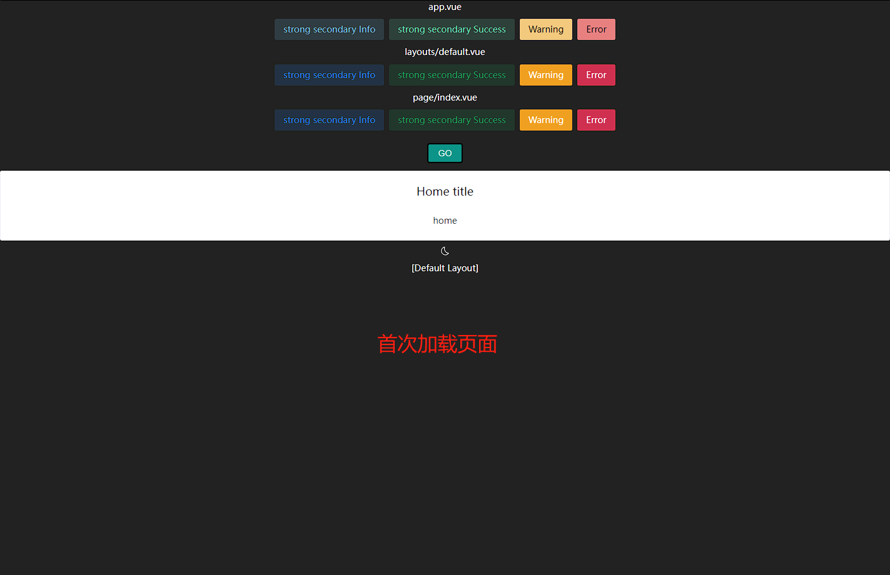
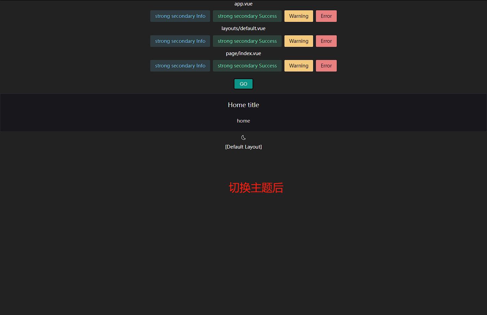

# naive UI 在 nuxt3 首次加载 bug
nuxt3 中使用 `NuxtLayout` 组件时，首次加载页面主题并未正常传递下去，使用 `@nuxtjs/color-mode` 切换主题后再切回来没问题

### first load


### switch mode


``` json
// package.json
{
  "devDependencies": {
    "@antfu/eslint-config": "^0.31.0",
    "@css-render/vue3-ssr": "^0.15.11",
    "@iconify-json/carbon": "^1.1.11",
    "@iconify-json/twemoji": "^1.1.7",
    "@nuxtjs/color-mode": "^3.2.0",
    "@pinia/nuxt": "^0.4.6",
    "@unocss/nuxt": "^0.46.5",
    "@vueuse/nuxt": "^9.6.0",
    "eslint": "^8.28.0",
    "naive-ui": "^2.34.2",
    "nuxt": "^3.0.0",
    "typescript": "^4.9.3",
    "unplugin-vue-components": "^0.22.11"
  }
}
```
---
``` ts
// nuxt.config.ts
import Components from 'unplugin-vue-components/vite'
import { NaiveUiResolver } from 'unplugin-vue-components/resolvers'

export default defineNuxtConfig({
  modules: [
    ...other,
    '@nuxtjs/color-mode',
  ],
  css: [
    // '@unocss/reset/tailwind.css',
  ],
  build: {
    transpile:
      process.env.NODE_ENV === 'production'
        ? ['naive-ui', 'vueuc', '@css-render/vue3-ssr', '@juggle/resize-observer']
        : ['@juggle/resize-observer'],
  },
  vite: {
    plugins: [
      Components({
        resolvers: [NaiveUiResolver()],
      }),
    ],
    ssr: {
      noExternal: ['naive-ui'],
    },
    optimizeDeps: {
      include:
        process.env.NODE_ENV === 'development'
          ? ['naive-ui', 'vueuc', 'date-fns-tz/esm/formatInTimeZone']
          : [],
    },
  },
})
```
---
``` ts
// plugins/naive-ui.ts
import { setup } from '@css-render/vue3-ssr'
import type { NuxtSSRContext } from '#app'
import { defineNuxtPlugin } from '#app'

export default defineNuxtPlugin((nuxtApp) => {
  if (process.server) {
    const { collect } = setup(nuxtApp.vueApp)
    const originalRenderMeta = nuxtApp.ssrContext?.renderMeta
    nuxtApp.ssrContext = nuxtApp.ssrContext || {} as NuxtSSRContext
    nuxtApp.ssrContext.renderMeta = () => {
      if (!originalRenderMeta) {
        return {
          headTags: collect(),
        }
      }
      const originalMeta = originalRenderMeta()
      if ('then' in originalMeta) {
        return originalMeta.then((resolvedOriginalMeta) => {
          return {
            ...resolvedOriginalMeta,
            headTags: resolvedOriginalMeta.headTags + collect(),
          }
        })
      }
      else {
        return {
          ...originalMeta,
          headTags: originalMeta.headTags + collect(),
        }
      }
    }
  }
})

```